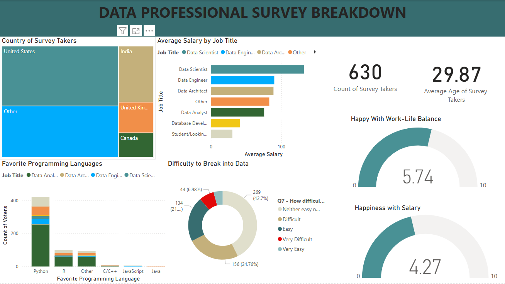

# 📊 Data Professional Survey Breakdown

## Overview  
This Power BI dashboard provides insights into survey responses from data professionals worldwide. It covers aspects such as job roles, salaries, programming language preferences, and work-life balance.

## 🔍 Key Features  
- **Country Distribution:** Visualizes where survey participants are located.  
- **Average Salary by Job Title:** Displays salary variations for different roles (Data Scientist, Data Engineer, etc.).  
- **Favorite Programming Languages:** Shows the most commonly used languages among data professionals.  
- **Difficulty to Break into Data Field:** Represents how challenging respondents found entering the data industry.  
- **Work-Life Balance & Salary Happiness:** Gauges overall satisfaction in the field.  

## 📷 Dashboard Preview  


## 🛠 Tools Used  
- 🟢 **Power BI** – For creating interactive visualizations  
- 📊 **Excel** – For data storage and manipulation  
- 🔄 **Power Query** – For data cleaning and transformation  

## 📂 Data Preparation  
1. The raw survey data was stored in **Excel**.  
2. **Power Query** was used to clean, transform, and structure the data.  
3. The cleaned data was then loaded into **Power BI** for visualization.  

## 🚀 How to Use  
1. **Clone this repository**:  
   ```bash
   git clone https://github.com/yourusername/data-professional-survey.git
